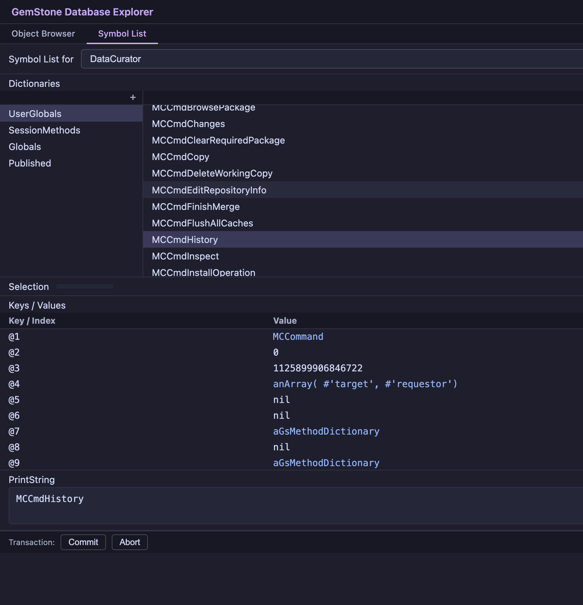

# GemStone Database Explorer

A Python/Flask web application for browsing and inspecting objects in a [GemStone/S](https://gemtalksystems.com/products/gs64/) object database. It started as a port of [maglev-database-explorer-gem](https://github.com/matthias-springer/maglev-database-explorer-gem), but the current app now includes a fuller browser/debugger toolset on top of [gemstone-py](https://github.com/unicompute/gemstone-py).



## Features

- Object inspectors with draggable object chips, linking arrows, eval, transaction controls, and backend-driven tabs
- Workspace windows that can evaluate code, open linked inspectors, and auto-open the debugger on halts
- Full Class Browser with dictionary/class/protocol/method panes, compile, file-out, structure editing, helper windows, and inspect actions
- Helper windows for method queries, hierarchy, and versions, including load/open/inspect flows
- Debugger windows with halted-thread summaries, stack frames, locals, thread-local storage, step/proceed/trim, and execution-point highlighting
- Symbol List Browser for users, dictionaries, entries, and value inspection
- MagLev-style custom object tabs such as `Attributes` for record-like objects
- Layout persistence, taskbar/task grouping, related-window actions, splitters, filters, and keyboard navigation
- About, Status Log, and Connection windows plus `/healthz`, `/diagnostics`, `/connection/preflight`, and support-bundle export for build/runtime visibility and diagnostics capture
- Mock and live Playwright UI suites in addition to Python route/object/session tests

## Requirements

- GemStone/S 64 3.x with accessible GCI libraries
- Python 3.11+
- [gemstone-py](https://github.com/unicompute/gemstone-py)

## Installation

```bash
git clone https://github.com/unicompute/python-gemstone-database-explorer
cd python-gemstone-database-explorer
python3 -m venv .venv
.venv/bin/pip install -e .
```

## Configuration

Set the GemStone connection environment before starting the app:

| Variable | Description | Example |
|---|---|---|
| `GEMSTONE` | Path to the GemStone installation | `/opt/gemstone/GemStone64Bit3.7.5-arm64.Darwin` |
| `GS_USERNAME` | GemStone login username | `DataCurator` |
| `GS_PASSWORD` | GemStone login password | `swordfish` |
| `GS_STONE` | Stone name | `seaside` |
| `GS_HOST` | Host running the Stone/NetLDI | `localhost` |
| `GS_NETLDI` | NetLDI service name or port | `50377` |

Depending on your platform/install, you may also need the native library path exported, for example:

```bash
export GS_LIB=/opt/gemstone/product/lib
```

If your Stone is named `seaside`, set `GS_STONE=seaside` before starting the app. The app also accepts `GS_STONE_NAME=seaside` as a compatibility alias, but the underlying client library reads `GS_STONE`.

See [docs/configuration.md](docs/configuration.md) for the complete environment details.

## Usage

```bash
.venv/bin/python-gemstone-database-explorer
```

Options:

```text
--host HOST    Bind host (default: 127.0.0.1)
--port PORT    Port (default: 9292)
--debug        Enable Flask debug mode
```

Then open `http://127.0.0.1:9292/` in a browser.

If startup fails because the wrong Stone name or local monitor target is configured, use the taskbar `Connection` window. It shows the effective target, the local `gslist -lcv` probe when available, and a copyable shell fix such as `export GS_STONE=seaside`.

## Testing

### Python

```bash
.venv/bin/python -m pytest -q
```

### UI

Install the Playwright dependency once:

```bash
npm install
```

Run the browser suite:

```bash
npm run test:ui
```

That always runs the deterministic mock-backed suite first. If `GEMSTONE`, `GS_USERNAME`, and `GS_PASSWORD` are present, it then runs the live GemStone suite automatically; otherwise it prints a skip message after the mock suite.

Run only the live UI suite:

```bash
export GEMSTONE=/opt/gemstone/GemStone64Bit3.7.5-arm64.Darwin
export GS_USERNAME=DataCurator
export GS_PASSWORD=swordfish

npm run test:ui:live
```

The live suite starts the real Flask app on `127.0.0.1:4192` and covers startup browsing, debugger flow, and a transactional Class Browser write flow that aborts its changes before the test ends.

## Documentation

- [Configuration](docs/configuration.md)
- [Architecture](docs/architecture.md)
- [API Reference](docs/api.md)
- [Changelog](CHANGELOG.md)

## License

MIT
